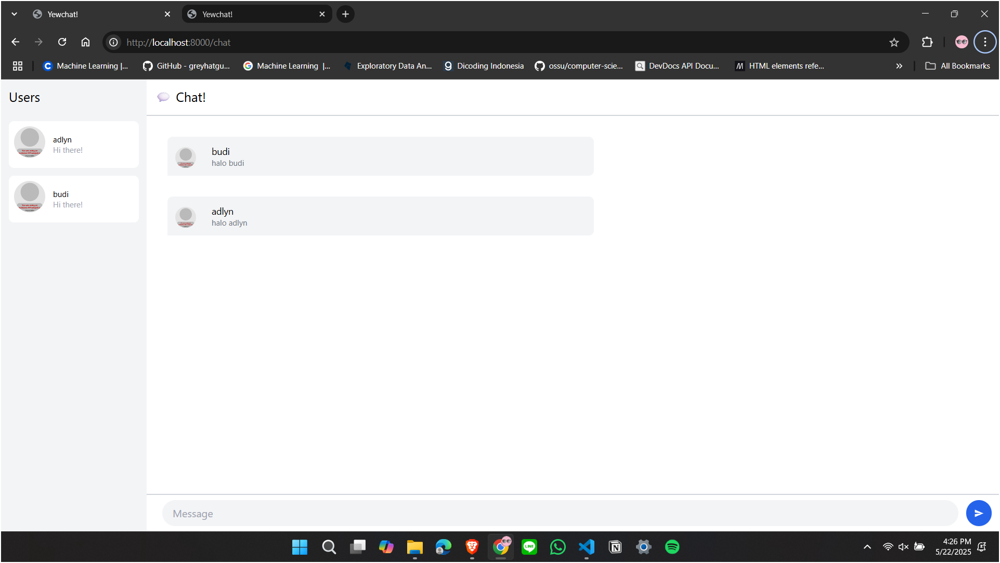
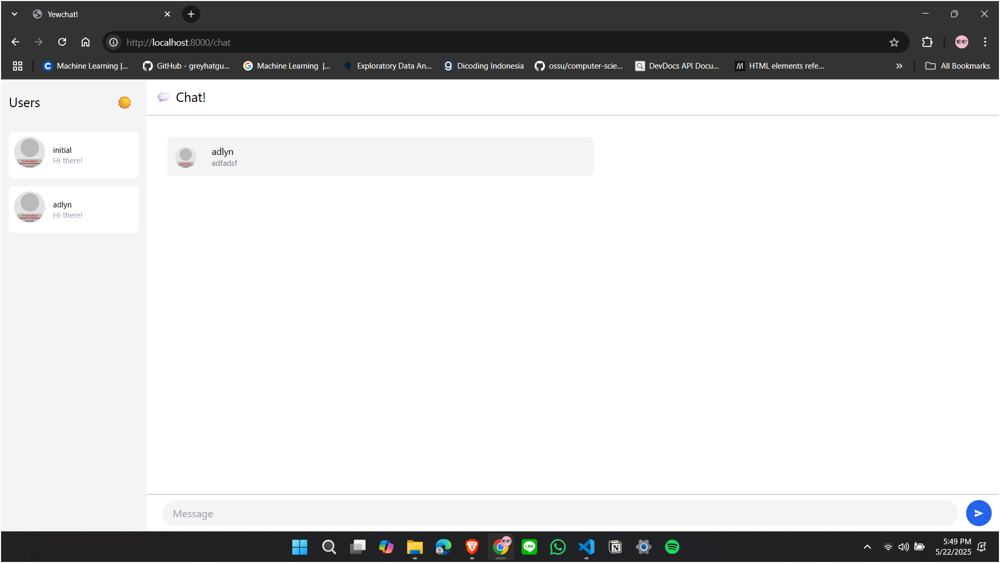
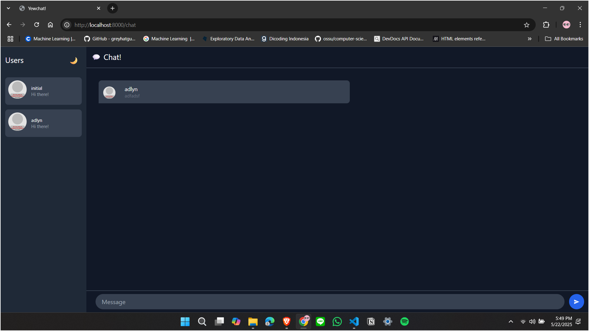

# Reflection

1. Initial Code  

2. Be Creative  

I enhanced YewChat by implementing a dark mode feature to improve user experience and accessibility. The interface now includes a simple yet effective dark mode toggle button, represented by sun (☀️) and moon (🌙) icons that switch based on the current theme. Users can easily toggle between light and dark themes with a single click, making the application more comfortable to use in different lighting conditions.

The dark mode applies a carefully selected color palette that reduces eye strain during nighttime usage, featuring darker backgrounds and appropriate contrast ratios for text and UI elements. When activated, the chat interface smoothly transitions to darker tones while maintaining readability and visual hierarchy. This feature is particularly beneficial for:

- Users who prefer working in low-light environments
- Reducing eye strain during extended chat sessions
- Accommodating users with light sensitivity

To use the dark mode:
1. Look for the sun/moon toggle button in the top-right corner of the users panel
2. Click the button to switch between light and dark themes
3. Your preference is applied immediately across the entire chat interface